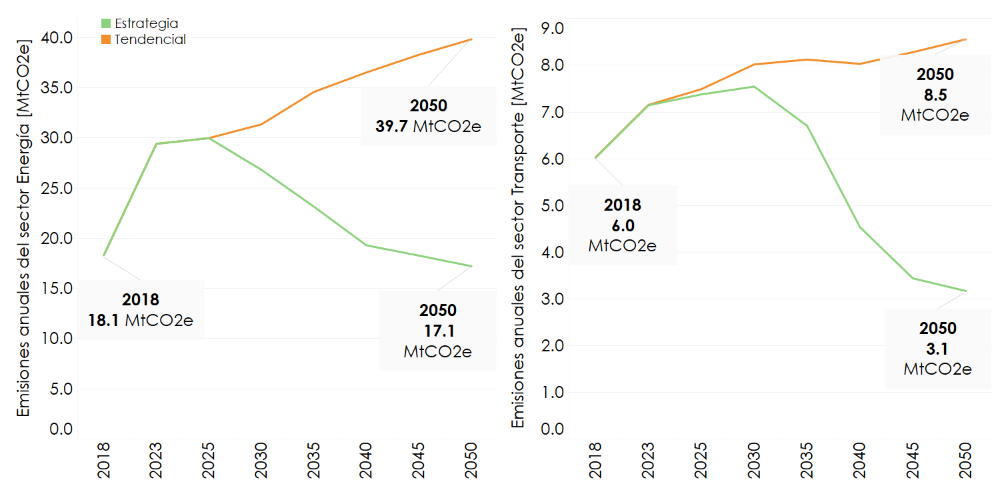
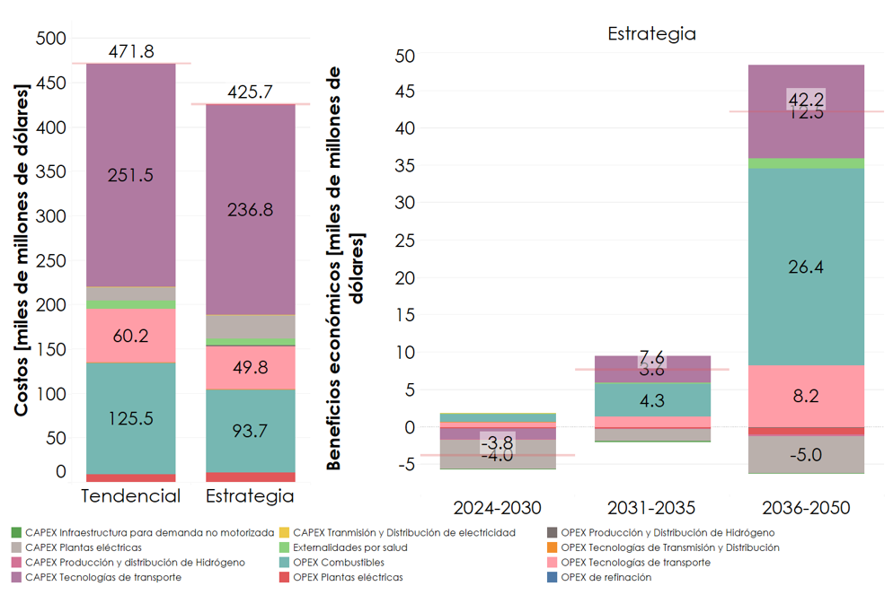

---------------------
Resultados
---------------------

En la **Figura 6** se presenta cómo las acciones transformadoras en el sector energía pueden reducir las emisiones en 22.6 MtCO2e en 2050 respecto al Escenario Tendencial. Además, se observa cómo 
las medidas de mitigación propuestas, como electrificación, mayor uso de transporte público y mayor despliegue de renovables reduciría las emisione del sector transporte en 5.4 MtCO2e en 2050. La **Figura 7** por otro lado
demuestra que se pueden reducir los costos de y obtener beneficios adicionales al implementar las acciones de mitigación, con un total de beneficio de 46 miles de millones de dólares.  

   **Figura 6:** Emisiones del sector Energía y Transporte.

   **Figura 7:** Costos y beneficios del sector Energía y Transporte.