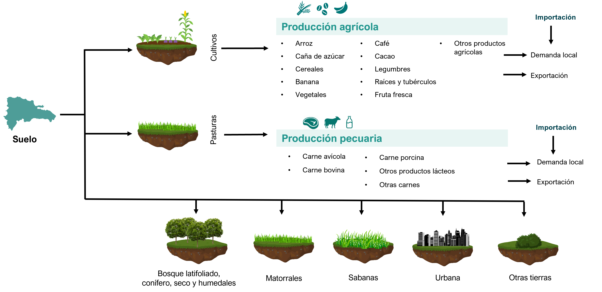

===================================
Estructura del Modelo
===================================

El sector AFOLU abarcar tres aristas importantes que son: agricultura, uso de la tierra, cambio del uso de la tierra y silvicultura. 
Cada una de estas conlleva distintos procesos y productos que han sido considerados para la modelación un resumen de la estructura de la modelación se muestra en la **Figura 8**.

   **Figura 8:** Esquema resumen de los aspectos considerados para el sector AFOLU.

**Tecnologías**

Las tecnologías utilizadas en el desarrollo del modelo del sector AFOLU corresponden a las presentes en la **Tabla 3**. 

.. list-table:: **Tabla 3.** Tecnologías del sector AFOLU
   :header-rows: 1
   :widths: 15 85

   * - **Código**
     - **Descripción**
   * - SOIALL
     - Suelo
   * - LU_FOR
     - Suelo forestal
   * - LU_AGR
     - Suelo para agricultura
   * - LU_GAN
     - Suelo para ganadería
   * - LU_LATHUM
     - Bosque latifoliado
   * - LU_DCON
     - Bosque conífero
   * - LU_WET
     - Humedales
   * - LU_DRY
     - Bosque seco
   * - IMPRIC
     - Importación de arroz
   * - IMPBAN
     - Importación de banano
   * - IMPSGC
     - Importación de caña de azúcar
   * - IMPCOC
     - Importación de cacao
   * - IMPTRVEG
     - Importación de otras hortalizas
   * - IMPCAF
     - Importación de café y productos derivados
   * - IMPLEG
     - Importación de legumbres
   * - IMPROT
     - Importación de raíces
   * - IMPFRT
     - Importación de frutas
   * - IMPCER
     - Importación de cereales
   * - IMPOTP
     - Importación de otros productos
   * - IMPLEC
     - Importación de leche
   * - IMPCARAVI
     - Importación de carne de ave
   * - IMPCARBOV
     - Importación de carne de res
   * - IMPOTRCARPRO
     - Importación de otros productos lácteos
   * - IMPCARPOR
     - Importación de carne de cerdo
   * - IMPOTRCAR
     - Importación de otras carnes
   * - AG_RIC
     - Arroz en tierras agrícolas
   * - AG_BAN
     - Banano en tierras agrícolas
   * - AG_SGC
     - Caña de azúcar en tierras agrícolas
   * - AG_COC
     - Cacao y productos en tierras agrícolas
   * - AG_CAF
     - Café y productos en tierras agrícolas
   * - AG_LEG
     - Legumbres en tierras agrícolas
   * - AG_ROT
     - Raíces en tierras agrícolas
   * - AG_FRT
     - Frutas en tierras agrícolas
   * - AGR_CER
     - Cereales en tierras agrícolas
   * - AG_TRVEG
     - Otras hortalizas en tierras agrícolas
   * - AGR_OTP
     - Otros productos en tierras agrícolas
   * - GA_LEC
     - Leche en pastizales
   * - GA_CARAVI
     - Carne de ave en pastizales
   * - GA_CARBOV
     - Carne de res en pastizales
   * - GA_CARPOR
     - Carne de cerdo en pastizales
   * - GA_OTRCARPRO
     - Otros productos lácteos en pastizales
   * - GA_OTRCAR
     - Otras carnes en pastizales
   * - T5RICAGR
     - Demanda de arroz para agricultura
   * - T5BANAGR
     - Demanda de banano para agricultura
   * - T5SGCAGR
     - Demanda de caña de azúcar para agricultura
   * - T5COCAGR
     - Demanda de cacao y productos para agricultura
   * - T5CAFAGR
     - Demanda de café y productos para agricultura
   * - T5LEGAGR
     - Demanda de legumbres para agricultura
   * - T5ROTAGR
     - Demanda de raíces para agricultura
   * - T5FRTAGR
     - Demanda de frutas para agricultura
   * - T5CERAGR
     - Demanda de cereales para agricultura
   * - T5TRVEGAGR
     - Demanda de otras hortalizas para agricultura
   * - T5OTPAGR
     - Demanda de otros productos para agricultura
   * - T5LECGAN
     - Demanda de leche para ganadería
   * - T5CARAVIGAN
     - Demanda de carne de ave para ganadería
   * - T5CARBOVGAN
     - Demanda de carne de res para ganadería
   * - T5CARPORGAN
     - Demanda de carne de cerdo para ganadería
   * - T5OTRCARPROGAN
     - Demanda de otros productos lácteos para ganadería
   * - T5OTRCARGAN
     - Demanda de otras carnes para ganadería
   * - T5RICAGREXP
     - Demanda de arroz para exportaciones agrícolas
   * - T5BANAGREXP
     - Demanda de banano para exportaciones agrícolas
   * - T5SGCAGREXP
     - Demanda de caña de azúcar para exportaciones agrícolas
   * - T5COCAGREXP
     - Demanda de cacao y productos para exportaciones agrícolas
   * - T5CAFAGREXP
     - Demanda de café para exportaciones agrícolas
   * - T5LEGAGREXP
     - Demanda de legumbres para exportaciones agrícolas
   * - T5ROTAGREXP
     - Demanda de raíces para exportaciones agrícolas
   * - T5FRTAGREXP
     - Demanda de frutas para exportaciones agrícolas
   * - T5CERAGREXP
     - Demanda de cereales para exportaciones agrícolas
   * - T5TRVEGAGREXP
     - Demanda de otras hortalizas para exportaciones agrícolas
   * - T5OTPAGREXP
     - Demanda de otros productos para exportaciones agrícolas
   * - T5LECGANEXP
     - Demanda de leche para exportaciones ganaderas
   * - T5CARAVIGANEXP
     - Demanda de carne de ave para exportaciones ganaderas
   * - T5CARBOVGANEXP
     - Demanda de carne de res para exportaciones ganaderas
   * - T5CARPORGANEXP
     - Demanda de carne de cerdo para exportaciones ganaderas
   * - T5OTRCARPROGANEXP
     - Demanda de otros productos lácteos para exportaciones ganaderas
   * - T5OTRCARGANEXP
     - Demanda de otras carnes para exportaciones ganaderas

