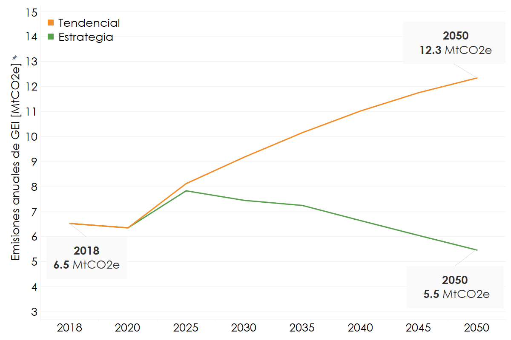
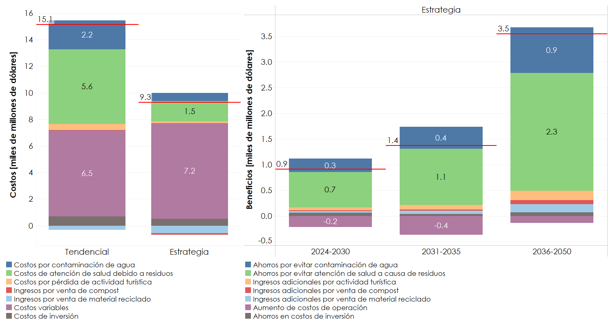

---------------------
Resultados
---------------------

En la **Figura 17** se presenta cómo las acciones transformadoras en el sector pueden reducir las emisiones en 6.8 MtCO2e en 2050 respecto al Escenario Tendencial. Además, en la **Figura 18** se observa cómo 
los costos del sector residuos se reducirían en 5 300 millones de dólares descontados acumulados para el periodo 2024-2050 debido a beneficios por una mejor gestión de residuos y la monetización
de prácticas de economía circular.

   **Figura 17:** Emisiones del sector Residuos.

   **Figura 18:** Costos y beneficios del sector Residuos.