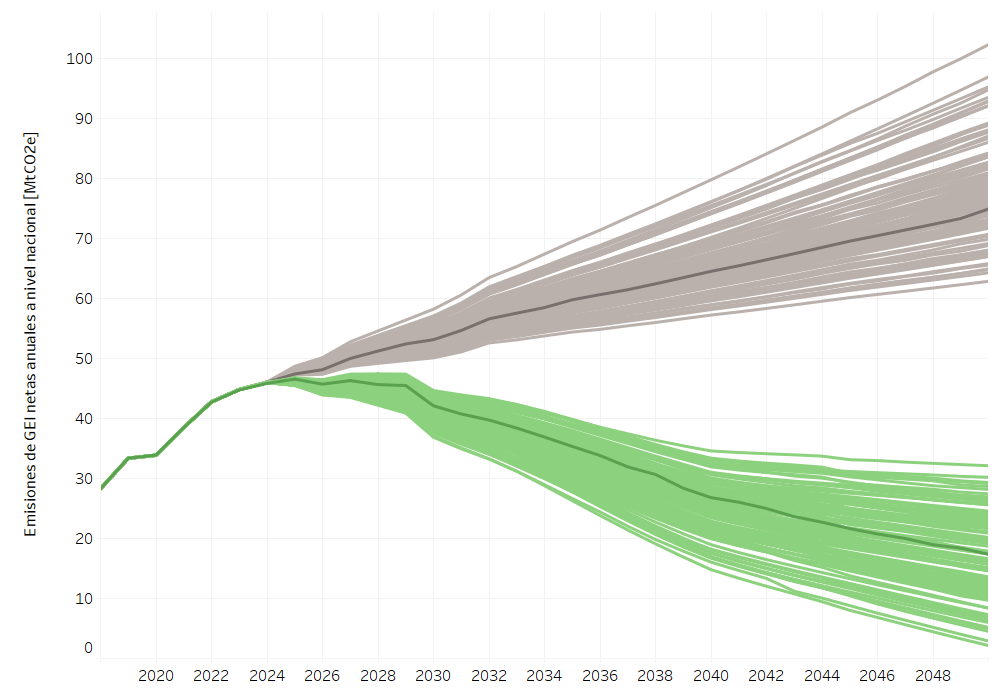
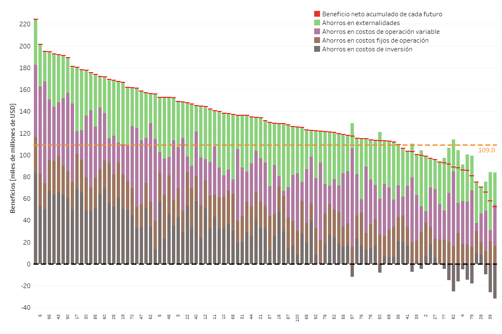

====================================
Resultados Nacionales
====================================

La **Figura 2** compara la trayectoria de las emisiones anuales de GEI en dos escenarios hasta 2050.
El escenario Tendencial muestra un crecimiento sostenido: parte de 28.2 Mt CO₂e en 2018 y alcanza cerca de 
75 Mt CO₂e en 2050. En contraste, el escenario Estrategia presenta emisiones descendentes a 2050, llegando a
 17.4 Mt CO₂e. La comparación ilustra el impacto de las medidas de mitigación propuestas, que logran invertir la
tendencia ascendente y reducir las emisiones aproximadamente 76%.

.. figure:: _static/_images/2_nacionales.png
   :alt: Models used on the cost and benefits analysis
   :width: 100%
   :align: center

   **Figura 2:** Resultados de reducción de emisiones nacionales

Además, se desarrolló un conjunto de escenarios futuros diseñados específicamente para incorporar las principales incertidumbres que podrían influir en el despliegue y
la ambición de las acciones de mitigación dentro del horizonte temporal considerado. Estas incertidumbres, seleccionadas a través de talleres participativos con expertos sectoriales,
afectan variables clave de cada sector y reflejan dinámicas complejas y cambiantes. 

La combinación de estas incertidumbres con los niveles de ambición definidos para las acciones de mitigación, también consensuados en los talleres, dio lugar a un total de 202 escenarios posibles.
Los resultados muestran que las emisiones nacionales en un escenario tendencial podrían variar entre 60 y 100 MtCO2e en 2050, mientras que, con la implementación de la estrategia, podrían reducirse
a un rango de 2 a 32 MtCO2e. 

En la **Figura 3** se observan las trayectorias de emisiones tanto para los futuros tendenciales, que se presentan de color gris, como para las rutas estudiadas para la formulación de
la Estrategia en color verde.

   **Figura 3:** Trayectorias de emisiones de gases de efecto invernadero para múltiples futuros bajo incertidumbre de escenario tendencial y de la estrategia baja en carbono y resiliente

En cuanto a los beneficios con respecto al escenario tendencial, cada futuro de la Estrategia alcanza distintos niveles, ya que las incertidumbres afectan la implementación de las acciones o políticas
en diferentes niveles cuantitativos. Por consiguiente, también es posible establecer un rango dentro del cual podrían llegar a ubicarse los beneficios (o en su defecto los costos), de cada uno de los
futuros evaluados. 

En la **Figura 4** puede notarse que todos los futuros del percentil superior conducen a beneficios netos con respecto al escenario tendencial y, además, este beneficio se encuentra entre 52 y 225 mil
millones de dólares actuales acumulados entre 2024 y 2050. Mostrando que optar por la Estrategia siempre traerá beneficios en el largo plazo para el país con respecto a optar por un escenario de ambición
reducida en las emisiones a mitad de siglo, como lo es el escenario tendencial. 

   **Figura 4:**  Beneficios acumulados a 2050 de los escenarios nacionales más favorables modelados (percentil superior, MMUSD de 2024) 