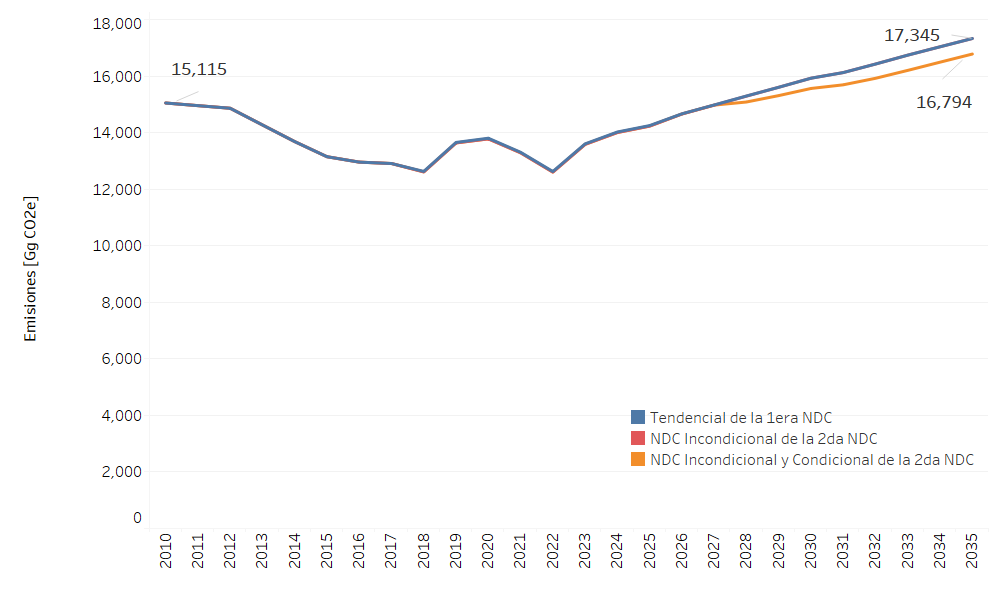

===================================
Resultados
===================================

La Figura 9 presenta las emisiones en CO2e para el sector Agricultura por año y escenario. En la figura la trayectoria azul representa el escenario Tendencial de la 1ra NDC, la trayectoria roja el escenario Incondicional de la 2da NDC y la trayectoria naranja el escenario Incondicional y Condicional de la 2da NDC. Para este sector los escenarios Incondicional e Incondicional+Condicional presentan la misma trayectoria.

   Figura 9. Emisiones en CO2equivalente del sector Agricultura por año y escenario.