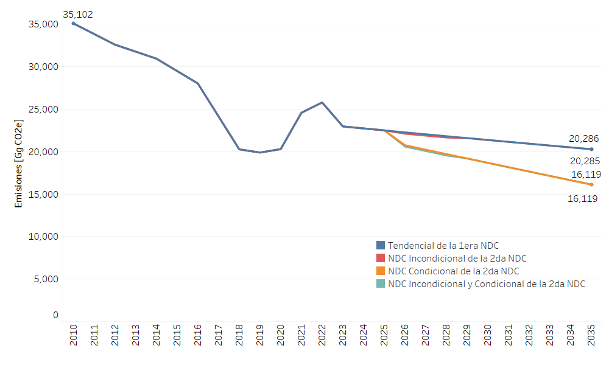

===================================
Resultados
===================================

La Figura 10 presenta las emisiones en CO2e para el sector USCUSS por año y escenario. En la figura la trayectoria azul representa el escenario Tendencial de la 1ra NDC, la trayectoria roja el escenario Incondicional de la 2da NDC y la trayectoria naranja el escenario Condicional de la 2da NDC. Para este sector los escenarios Tendencial e Incondicional tienen comportamientos similares, mientras que el Condicional tiene la mayor reducción de emisiones debido a las iniciativas analizadas.

   Figura 10. Emisiones en CO2equivalente del sector USCUSS por año y escenario.