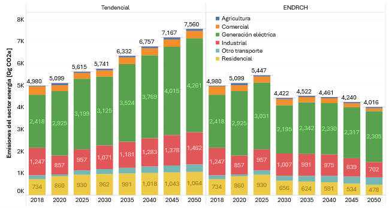
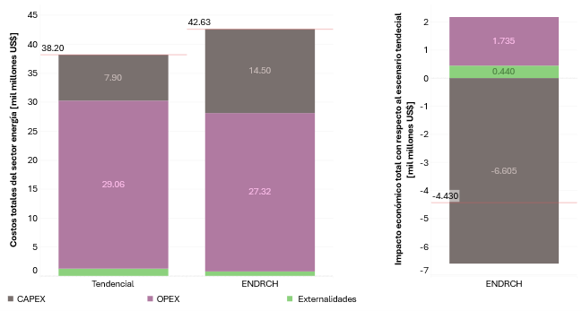

---------------------
Resultados
---------------------

En la **Figura 3** se  compara las emisiones del sector energético en Honduras bajo los escenarios Tendencial y ENDRCH al 2050.
Mientras el escenario Tendencial muestra un aumento sostenido de emisiones, el ENDRCH refleja una reducción significativa gracias a
medidas como electrificación, eficiencia energética y uso de renovables. Para 2050, las emisiones se reducen en casi 50 % respecto al Tendencial.

Además, la **Figura 4** muestra los costos del sector energético bajo los escenarios Tendencial y ENDRCH. Aunque el ENDRCH implica mayores
inversiones (CAPEX), presenta menores costos operativos (OPEX) y una importante reducción de externalidades, resultando en un impacto económico
neto más favorable. En conjunto, el escenario ENDRCH representa un ahorro de 4.43 mil millones de USD respecto al Tendencial.

   **Figura 3:** Emisiones del sector energía por subsector de consumo para escenario Tendencial y ENDRCH

   **Figura 4:** Costos acumulados totales en el sector energía para los escenarios Tendencial y ENDRCH