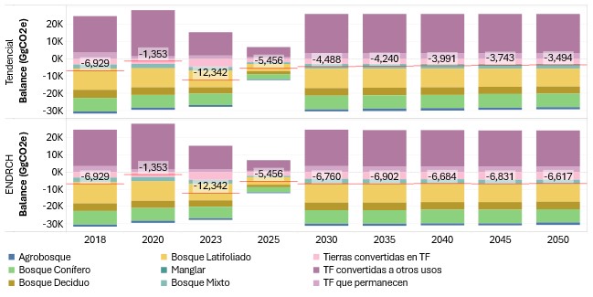
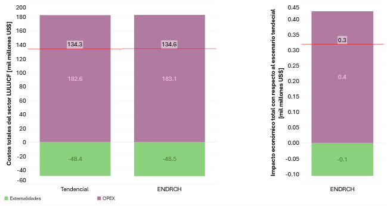

---------------------
Resultados
---------------------

La **Figura 6** evidencia que, para el año 2050, el escenario ENDRCH logra una captura neta de 6,617 Gg CO₂e,
frente a 3,494 Gg CO₂e en el escenario Tendencial, lo que representa una mejora del 89 % en la capacidad de captura de carbono.
Por su parte, la **Figura 7** muestra que, aunque los costos totales son similares, el escenario ENDRCH genera externalidades positivas 
adicionales que resultan en un ahorro neto de 0.3 mil millones de USD respecto al escenario Tendencial.

   **Figura 6:** Emisiones del sector LULUCF para escenario Tendencial y ENDRCH

   **Figura 7:** Costos acumulados totales en el sector LULUCF para los escenarios Tendencial y ENDRCH