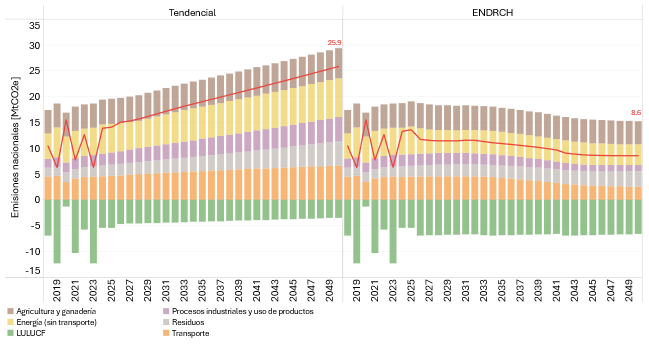

====================================
Resultados Nacionales
====================================

Las proyecciones de emisiones al 2050 identifican sectores clave para la mitigación, especialmente el transporte y el
potencial de remoción en LULUCF. Según las proyecciones realizadas con el modelo ENDRCH-HON, se espera una reducción de emisiones del 67% al 2050 respecto al escenario
tendencial, como se ilustra en la **Figura 2**, reflejando el impacto de medidas transformadoras integradas.

   **Figura 2:** Estimaciones de emisiones de GEI 2018-2050
