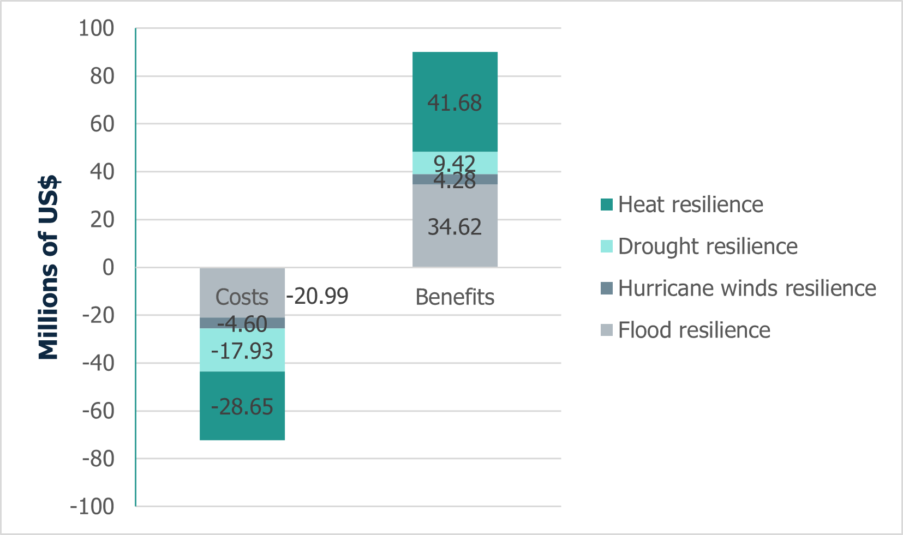

===================================
Results
===================================

Jamaica's LTS for the cultural sector focuses on enhancing the resilience of heritage
infrastructure to climate risks while promoting cultural preservation. Although only infrastructure-related
costs and benefits are assessed due to data limitations, the results show that such investments are economically
viable. Measures like elevating structures, installing hurricane-resistant features, and improving energy and water
efficiency yield significant returns. As illustrated in **Figure 17**, actions related to heat and flood resilience—such as
insulation, lightweight concrete walls, and elevated structures—deliver the highest economic benefits, supporting both
cultural heritage protection and community well-being.

   **Figure 17:** Figure 17. Costs and benefits disaggregated from the modelling process for adaptation actions in the Culture Sector.
