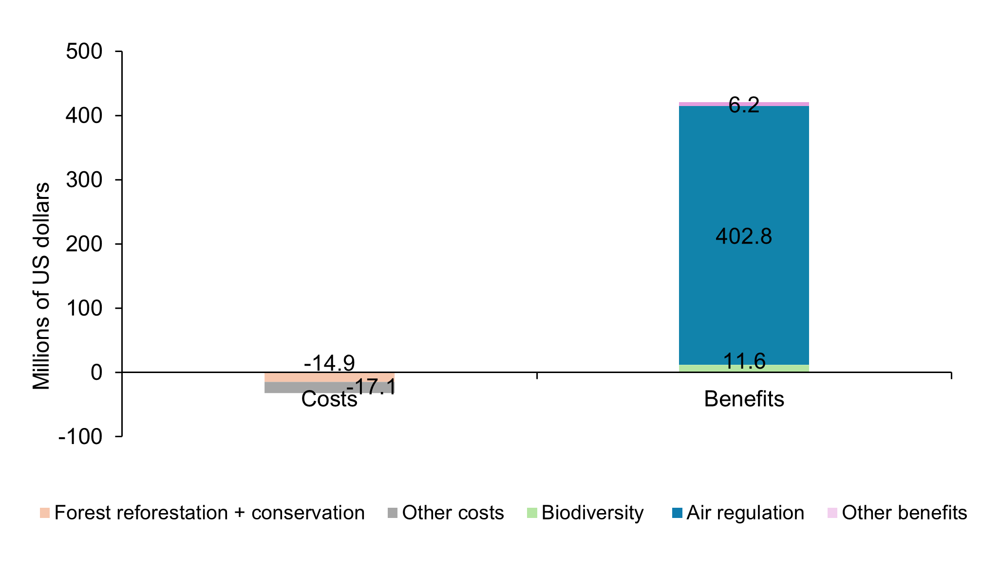

===================================
Results
===================================

 **Figure 12** show that adaptation actions in the Ecosystems sector yield significant benefits,
 with a net gain of US$388.6 million from 2025 to 2050. The primary benefit, valued at US$402.8 million,
 comes from improved air quality regulation through reforestation of 14,500 hectares, using a conservative estimate of
 US$4,686 per hectare. While reforestation incurs the highest cost at US$14.9 million, it provides long-term ecological and
 economic value. Other costs include forest planning, training, and monitoring, while additional benefits include erosion control,
 temperature regulation, and tourism enhancement.

   **Figure 12:** Costs and benefits disaggregated from the modelling process for adaptation actions in the Terrestrial Ecosystems sector. 
