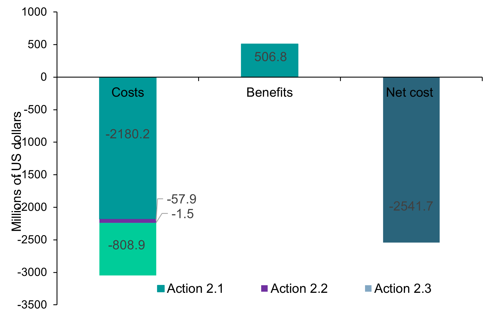

===================================
Results
===================================

**Figure 13** modeling results for the Human Settlement sector show that only housing solutions
(Action 2.1) currently have quantified benefits, amounting to $508.8 million, while the
total cost of all actions is approximately $3,048 million, resulting in a net cost of -$2,541.7
million. Significant data gaps exist, particularly for low-carbon cooling, coastal defenses,
and microinsurance, and further stakeholder engagement is needed to refine cost-benefit estimates.

For the Critical Infrastructure sector, results from **Figure 14** show the total benefits ($3,442 million) exceed costs
($1,110 million), yielding a net benefit of $2,332 million, largely driven by avoided costs
from a nationwide non-revenue water reduction program. While some actions show higher costs
than benefits, unquantified advantages like improved water quality, reduced flooding, and better
public health could further enhance the sector’s economic returns.

   **Figure 13:** Costs and benefits disaggregated from the modelling process for adaptation actions
   in the Critical Infrastructure sector (Action 2.1 Housing Solutions, 2.2 Low-carbon cooling, 2.3 Microinsurance products, 2.4, Building coastal protection).

.. figure:: ../../_static/_images/14_criticalinfra2.png
   :alt: Models used on the cost and benefits analysis
   :width: 80%
   :align: center

   **Figure 14:** Costs and benefits disaggregated from the modelling process for adaptation actions
   in the Critical Infrastructure sector (Action 2.1 Housing Solutions, 2.2 Low-carbon cooling, 2.3 Microinsurance products, 2.4, Building coastal protection).