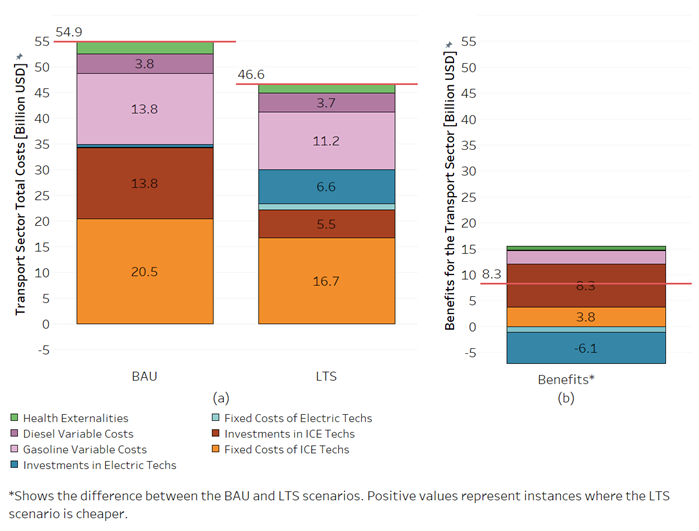

---------------------
Results
---------------------

**Figure 5** shows that the implementation of mitigation actions in the transport sector yields a net benefit of $8.3 billion compared to the BAU scenario.

   **Figure 5:** : Preliminary results for the Transport sector: (a) costs of the BAU and LTS scenarios, and (b) benefits of implementing
   the LTS -cost difference between the BAU and LTS scenarios-.
