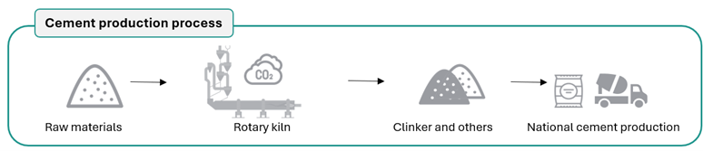

===================================
Model Structure
===================================

This part of the model primarily relies on national data, including energy balances,
fuel prices published annually by the Office of Utilities Regulation and the annual production figures for products like cement.
**Figure 6** highlights aspects of cement production, relevant to model the clinker-to-cement ratio reduction targeted by the LTS.

   **Figure 6:** Key elements represented in cement production.

**Technologies**

.. list-table:: **Table 5.** Industry and IPPU Sector Technologies
   :header-rows: 1
   :widths: 15 22 18 45

   * - **Sector**
     - **Sub-sector**
     - **Technology**
     - **Description**

   * - Industry
     - Cement production
     - T5DSLINDCEM
     - Demand – Diesel for industrial cement

   * - Industry
     - Cement production
     - T5GSLINDCEM
     - Demand – Gasoline for industrial cement

   * - Industry
     - Cement production
     - T5NGSINDCEM
     - Demand – Natural gas for industrial cement

   * - Industry
     - Cement production
     - T5ELEINDCEM
     - Demand – Electricity for industrial cement

   * - Industry
     - Cement production
     - T5HYDINDCEM
     - Demand – Hydrogen for industrial cement

   * - Industry
     - Cement production
     - T5COKINDCEM
     - Demand – Coke for industrial cement

   * - Industry
     - Cement production
     - T5BIMINDCEM
     - Demand – Biomass for industrial cement

   * - Industry
     - Cement production
     - T5COAINDCEM
     - Demand – Coal for industrial cement

   * - Industry
     - Cement production
     - T5FOIINDCEM
     - Demand – Fuel oil for industrial cement

   * - IPPU
     - Cement-production process
     - RAW_MAT_CLK
     - Supply of raw material for clinker

   * - IPPU
     - Cement-production process
     - PROD_CLK_TRAD
     - Traditional clinker production

   * - IPPU
     - Lime
     - LIME
     - Lime production

   * - IPPU
     - HFCs
     - IMP_R32
     - Import of refrigerant R-32

   * - IPPU
     - HFCs
     - T5R32IPPU
     - Demand – R-32 for industrial processes

   * - Industry
     - Construction
     - T5DSLCON
     - Demand – Diesel for construction

   * - Industry
     - Industry (cross-cutting)
     - CCS_FLO
     - Floating carbon-capture and storage
