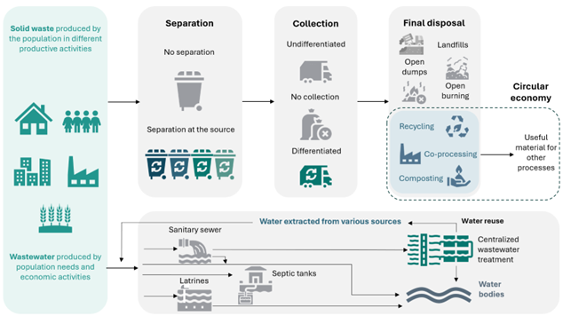

===================================
Model Structure
===================================

**Figure 8** shows the value chain considered in the waste sector and the key elements considered in
the modelling of the sector at the different stages of waste management.

   **Figure 8:** Key elements represented for the waste management sector.

**Technologies**

.. list-table:: **Table 7.** Waste and Wastewater Technologies
   :header-rows: 1
   :widths: 22 20 58

   * - **Subsector**
     - **Technology**
     - **Description**

   * - Solid waste
     - INORG_RCY_OS
     - Recycling of separated inorganic waste at final-disposal site
   * - Solid waste
     - AD
     - Anaerobic digestion
   * - Solid waste
     - COMPOST
     - Composting
   * - Solid waste
     - LANDFILL
     - Landfill
   * - Solid waste
     - NO_CONTR_OD
     - Open dump
   * - Solid waste
     - COPROC
     - Co-processing
   * - Solid waste
     - INCIN
     - Controlled incineration
   * - Solid waste
     - OPEN_BURN
     - Open burning
   * - Solid waste
     - SIT_CLAN
     - Disposal in clandestine sites
   * - Solid waste
     - OSS_INORG
     - Separation of inorganic waste at final-disposal site
   * - Solid waste
     - OSS_ORG
     - Separation of organic waste at final-disposal site
   * - Solid waste
     - NO_OSS_BLEND
     - No separation of mixed waste at final-disposal site
   * - Solid waste
     - NO_OSS_NO_COLL
     - No collection of mixed solid waste at final-disposal site
   * - Solid waste
     - INORG_DCOLL
     - Differentiated collection of inorganic waste
   * - Solid waste
     - ORG_DCOLL
     - Differentiated collection of organic waste
   * - Solid waste
     - BLEND_NO_DCOLL
     - Undifferentiated collection of mixed waste
   * - Solid waste
     - BLEND_NO_COLL
     - No collection of mixed solid waste
   * - Solid waste
     - INORG_SS
     - Separation of inorganic waste at source
   * - Solid waste
     - ORG_SS
     - Separation of organic waste at source
   * - Solid waste
     - NO_SS
     - No separation of waste at source
   * - Solid waste
     - T5TSWTSW
     - Total solid waste
   * - Solid waste
     - LANDFILL_ELEC
     - Methane recovery in landfill to generate electricity
   * - Wastewater
     - AERO_PTAR
     - Centralised aerobic treatment plant
   * - Wastewater
     - AERO_PTAR_RU
     - Re-use of treated water from centralised aerobic plant
   * - Wastewater
     - ANAE_LAGN
     - Anaerobic lagoon
   * - Wastewater
     - ANAE_LAGN_RU
     - Re-use of treated water from anaerobic lagoon
   * - Wastewater
     - SEPT_SYST
     - Septic system
   * - Wastewater
     - LATR
     - Latrine
   * - Wastewater
     - EFLT_DISC
     - Effluent discharge to aquatic environment
   * - Wastewater
     - SEWER_NO_T
     - Untreated water in sewer
   * - Wastewater
     - WWWT
     - Waste-water with treatment
   * - Wastewater
     - WWWOT
     - Waste-water without treatment
   * - Wastewater
     - SEWERWW
     - Collected waste-water
   * - Wastewater
     - DIRECT_DISC
     - Uncollected waste-water
   * - Wastewater
     - T5TWWTWW
     - Total waste-water
   * - Wastewater
     - IWW
     - Industrial waste-water
