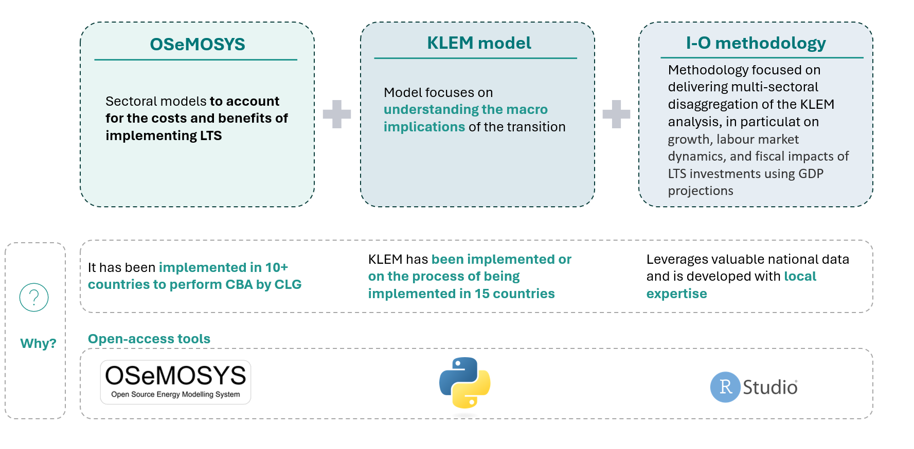

====================================
Methodology
====================================

The project evaluates the costs and benefits of Jamaica’s Long-Term Strategy (LTS) through
a participatory approach that includes local stakeholder input and accounts for uncertainties affecting outcomes.
It applies the Robust Decision-Making (RDM) framework to support resilient policy assessment. The analysis involves the
modeling of mitigation and adaptation actions to climate change, helping to identify key data, costs, and benefits,
and ensuring the strategy aligns with national priorities while addressing social, economic, and environmental impacts.

**Figure 1** shows the three key models that guided the analysis.

   **Figure 1:** Models used in the cost and benefits analysis.

Approach for Mitigation Actions
----------------------------------

The methodology used to develop the sectoral models is based on:

1. **Development of the XLRM Matrix**  
   An initial XLRM matrix was created to identify uncertainties and key variables affecting mitigation outcomes. An XLRM matrix is a compact mapping tool from
   Robust Decision-Making that organises four elements side by side: exogenous uncertainties (X) that lie outside our control, the policy levers (L) we can actively
   adjust, the system responses (R) the model is expected to exhibit when those levers are exercised under different uncertainties, and the performance metrics (M) used
   to judge whether the outcomes are satisfactory.

2. **Construction of Baseline Scenarios**  
   Two baseline scenarios were developed:
   
   - **Reference scenario (business-as-usual):** No additional decarbonization policies implemented.
   - **LTS scenario:** Incorporates mitigation actions included in the Long-Term Strategy (LTS).

3. **Modeling with OSeMOSYS**  
   The models were built using OSeMOSYS, an open-source tool for energy system modeling.

4. **Simulation of Uncertainties**  
   A total of 100 possible futures were modeled, based on the uncertainties and their ranges defined in the XLRM matrix.

5. **Analysis of Costs and Benefits**  
   The variation in uncertainties influenced the expected ranges of costs and benefits resulting from LTS implementation.

Approach for Adaptation Actions
-----------------------------------

The methodology for evaluating adaptation strategies in the LTS is structured as follows:

1. **Differentiation of Strategies**  
   Due to the nature of adaptation and mitigation, adaptation strategies are addressed qualitatively, while mitigation strategies follow quantitative targets.

2. **Linking Goals to Actions**  
   The broader adaptation objectives of the LTS were connected to specific plans, targets, and initiatives already being implemented or planned by sectoral entities.

3. **Breakdown of Objectives**  
   These general adaptation goals were disaggregated into concrete and actionable strategies, allowing alignment with measurable outcomes for impact evaluation.

4. **Cost-Benefit Analysis of Adaptation**  
   An open-access tool developed by GIZ was used to conduct cost-benefit analyses of the identified adaptation scenarios.

5. **Assessment of Economic Impacts**  
   The analysis provides estimates of incremental investments and savings associated with the implementation of the LTS adaptation actions.

6. **Incorporation of Uncertainty**  
   The influence of uncertainty was assessed through the application of Robust Decision Making (RDM) techniques to the adaptation models.

Approach for Macroeconomic Analysis
---------------------------------------

The methodology for analyzing the macroeconomic effects of LTS implementation is based on:

1. **Objective of the Analysis**  
   The project seeks to understand the macroeconomic impacts of implementing the LTS, focusing on key economic indicators and their relation to sustainable development.

2. **Use of the iSDG Model**  
   The Integrated Sustainable Development Goals (iSDG) model of Jamaica was applied to assess the LTS’s effects on SDG indicators and critical economic variables.

3. **Mapping LTS to SDGs**  
   LTS milestones were systematically mapped to specific SDG indicators, ensuring a data-driven and coherent evaluation of policy impacts.

4. **Evaluation of Policy Impacts**  
   The model enables analysis of the environmental, economic, and social effects of mitigation strategies, aligning them with national priorities and global commitments.

5. **Preliminary Results and Model Calibration**  
   The results presented are preliminary, highlighting the need for further calibration of the iSDG model to enhance reliability and accuracy.

.. note::
   The methodology follows the principles of transparency and
   reproducibility, allowing for future adjustments and improvements.
