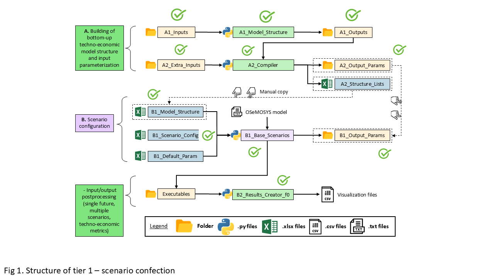

=========================
How to use the models?
=========================

We used a mitigation model built with OSeMOSYS to quantify the costs and benefits of implementing LTS mitigation actions
across different scenarios and futures. For adaptation, we developed a separate model using an open-access cost-benefit
analysis tool to evaluate the economic impacts of sector-specific adaptation strategies aligned with the LTS, also incorporating  
uncertainty analysis through RDM.

Mitigation Model 
-------------------------------

First, it is important to consider the workflow shown in Figure 1. This workflow indicates which files are important for executing each step and provides a better general understanding.

   **Figure 19:** Workflow of the OSeMOSYS-ECU model

**Create the model structure (A1)**

The first step of OSeMOSYS-ECU is to create the model structure. To do this, you need to run the Python script ``A1_Model_Structure``. To run this script, it is necessary to parameterize the Excel files inside ``A1_Inputs``:

- ``A-I_Classifier_Modes_Demand``
- ``A-I_Classifier_Modes_Supply``
- ``A-I_Classifier_Modes_Transport``
- ``A-I_Horizon_Configuration``

Then, you must run the Python script ``A1_Model_Structure``. After the execution is complete, some files will be generated inside ``A1_Outputs``:

- ``A-O_AR_Model_Base_Year.xlsx``
- ``A-O_AR_Projections.xlsx``
- ``A-O_Demand.xlsx``
- ``A-O_Fleet.xlsx``
- ``A-O_Parametrization.xlsx``
- ``A-O_Fleet_Groups.pickle``

These files are overwritten with the default structure each time the Python script is run, so it is recommended to run this script only once.

**Model compiler (A2)**

The second step consists of defining the process to compile the model into parameter files. To do this, it takes as inputs the Excel files from ``A1_Outputs``, as well as the Excel files from the ``A2_Xtra_Inputs`` folder and the file ``A2_Structure_Lists``. Then, run this Python script.

It is important to have in the folder ``A2_Outputs_Params/Default``, the default files by parameter used by the Python script ``A2_Compiler``. This script generates some files in the ``A1_Outputs`` and ``A2_Outputs_Params`` folders. In the second folder, the same number of subfolders as there are scenarios in the model is generated, and inside these subfolders, Excel files with data by parameter are found.

**Create the input file (B1)**

The next step is longer and requires care. It is important to follow the workflow in the figure at the beginning of the section. First, go to the folder ``B1_Output_Params`` and delete any subfolder you find there. Then, go to the folder ``A2_Outputs_Params``, copy the folders with the names of the scenarios, and paste them into ``B1_Output_Params``. It is also necessary to manually copy the data from the file ``A2_Structure_Lists.xlsx`` to the file ``B1_Model_Structure``.

Next, you must parameterize the model in the files ``B1_Scenario_Config.xlsx``.

To write the model, use the script ``B1_Base_Scenarios_Adj_Parallel.py``.

The results of this execution are found in the folder ``B1_Output_Params``. The files in this folder overwrite those from the ``A2`` step outputs. Additionally, the model file is located in the ``Executables`` folder, inside a subfolder for each scenario. This file is a text file, for example:

- ``BAU_0.txt``

**Model execution (B1)**

To run the model, use the script ``B1_Base_Scenarios_Adj_Parallel.py``.

The results of this execution are found in the ``Executables`` folder, inside a subfolder for each scenario, and generate three files.

**Results concatenation (B2)**

This step facilitates the analysis of results. When running the Python script ``B2_Results_Creator_f0.py``, it takes the CSV files with input and output data of the model for each scenario, concatenates them, and creates four files:

- ``Scenario_Name_Input.csv``
- ``Scenario_Name_Input_2024_10_22.csv``
- ``Scenario_Name_Output.csv``
- ``Scenario_Name_Output_2024_10_22.csv``

The files with dates allow tracking of executions made on different dates, as the files without dates are overwritten with each execution.

Adaptation Model 
-------------------------------

**Overview**

The *Metodología para la Priorización de Medidas de Adaptación frente al Cambio Climático* is a structured approach developed by GIZ to support decision-makers in evaluating and ranking adaptation measures. It is based on multi-criteria analysis (MCA) and participatory processes, ensuring that prioritized actions are effective, feasible, and aligned with local needs.

**Steps for Using the Methodology**

   1. **Define the Context**
      - Determine the geographical scope (national, regional, or local).
      - Identify the climate risks (e.g., droughts, floods) and sectors (e.g., agriculture, water resources).

   2. **Identify Adaptation Measures**
      - Collect a list of potential adaptation actions from existing plans, expert input, or community consultations.
      - Include structural (infrastructure) and non-structural (policies, education) measures.

   3. **Establish Evaluation Criteria**
      - Common criteria include:
      - **Effectiveness:** How well does the measure reduce climate risk?
      - **Feasibility:** Technical, social, and institutional capacity for implementation.
      - **Cost:** Initial investment and operational costs.
      - **Co-benefits:** Additional environmental, social, or economic benefits.
      - **Urgency & Equity:** How urgent is the measure, and who benefits?

   4. **Engage Stakeholders**
      - Conduct workshops with stakeholders (government, civil society, technical experts).
      - Define and weight evaluation criteria based on local priorities.

   5. **Score and Rank Measures**
      - Evaluate each adaptation measure against the selected criteria.
      - Apply weights to reflect the importance of each criterion.
      - Use scoring matrices (e.g., Excel-based tools) to calculate final scores.

   6. **Interpret Results**
      - Generate a ranked list of prioritized measures.
      - Use this list to guide adaptation
