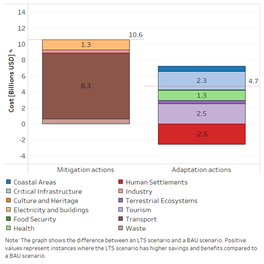

====================================
National Results
====================================

This project evaluates the costs and benefits of Jamaica’s Long-Term Strategy (LTS)
to support decision-making and align it with national development priorities.
Preliminary results indicate that implementing the LTS could generate up to 15.3 billion USD in benefits by 2050,
from both mitigation and adaptation actions. Mitigation benefits cover sectors like electricity, transport, industry,
and waste, while adaptation benefits are linked to climate resilience initiatives. Agriculture-related mitigation is
included under food security, and forestry under terrestrial ecosystems. **Figure 2** presents the preliminary results of the analysis.

   **Figure 2:** Preliminary for CBA: (a) benefits of implementing Mitigation actions
   (Electricity and buildings, Transport, Industry and Waste) (b) benefits of implementing the adaptation of LTS actions.

